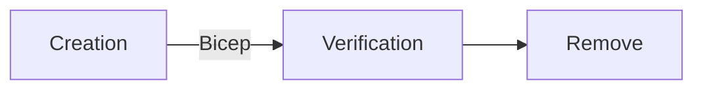

# Bicep testing framework

This framework is intended to work as a testing framework for Azure deployment features by using [Bicep](https://docs.microsoft.com/en-us/azure/azure-resource-manager/bicep/overview?tabs=bicep).

In order to see how you can work with this framework you can find one sample bicep file in the folder [samples](./samples/dotnet/samples/pwsh/resourceGroup.bicep)
that will be deployed by using one PowerShell script.

Process is the following:

**Creation**: New Features are gonna be deployed through Bicep files
**Verification**: Test is going to confirm the resource exists and also assert if it matches the expected value
**Remove**: Optionally resources can be removed after being tested

## Getting started
See [Getting Started](docs/getting_started.md) guide on how to start development on *Benchpress*.

## Contributing

This project welcomes contributions and suggestions. Most contributions require you to agree to a
Contributor License Agreement (CLA) declaring that you have the right to, and actually do, grant us
the rights to use your contribution. For details, visit `https://cla.opensource.microsoft.com`.

When you submit a pull request, a CLA bot will automatically determine whether you need to provide
a CLA and decorate the PR appropriately (e.g., status check, comment). Simply follow the instructions
provided by the bot. You will only need to do this once across all repos using our CLA.

This project has adopted the [Microsoft Open Source Code of Conduct](https://opensource.microsoft.com/codeofconduct/).
For more information see the [Code of Conduct FAQ](https://opensource.microsoft.com/codeofconduct/faq/) or
contact [opencode@microsoft.com](mailto:opencode@microsoft.com) with any additional questions or comments.

## Trademarks

This project may contain trademarks or logos for projects, products, or services. Authorized use of Microsoft
trademarks or logos is subject to and must follow
[Microsoft's Trademark & Brand Guidelines](https://www.microsoft.com/en-us/legal/intellectualproperty/trademarks/usage/general).
Use of Microsoft trademarks or logos in modified versions of this project must not cause confusion or imply Microsoft sponsorship.
Any use of third-party trademarks or logos are subject to those third-party's policies.
