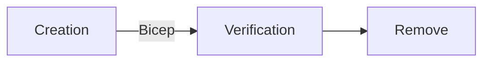

# Bicep testing framework

This is a testing framework for Azure deployments using [Bicep](https://docs.microsoft.com/en-us/azure/azure-resource-manager/bicep/overview?tabs=bicep).

An example of how to use this framework can be found in the [Powershell Test Sample](docs/powershell_test_sample.md) guide.

The process of the tests is the following:

**Creation**: New Features are deployed using Bicep files
**Verification**: Tests confirm that the resource exists and that it matches the expected values
**Remove**: Optionally, resources can be removed after being tested

## Benchpress Architecture

BenchPress uses [gRPC](https://grpc.io/docs/what-is-grpc/introduction/) to create a multi-language testing framework.

The BenchPress Test Engine is a C# gRPC Server located under `/engine/BenchPress.TestEngine`. The Test Engine is responsible
for the business logic of deploying Bicep files, obtaining information about deployed resources in Azure, and cleaning up the
deployment afterward.

The BenchPress Test Frameworks (located under `/framework/`) are gRPC Clients of multiple languages. The Test Frameworks are
responsible interfacing between the user's tests (written in their chosen language) and the Test Engine. They are also
responsible for managing the life cycle of the Test Engine.

gRPC uses [protocol buffers](https://developers.google.com/protocol-buffers/docs/overview). The `/protos/` folder contains BenchPress's .proto files. These define the API that the gRPC
Server and Clients use to communicate.

## Getting started

See [Getting Started](docs/getting_started.md) guide on how to start development on *Benchpress*.

## Deveplopment Tips

See [Github Actions Lint Workflow](docs/github_actions_lint_workflow.md) for how to maintain the CI/CD pipeline.

See [Manually Testing the Test Engine](docs/manually_testing_the_test_engine.md) for guidance on exploring the gRPC endpoints.

## Contributing

This project welcomes contributions and suggestions. Most contributions require you to agree to a
Contributor License Agreement (CLA) declaring that you have the right to, and actually do, grant us
the rights to use your contribution. For details, visit `https://cla.opensource.microsoft.com`.

When you submit a pull request, a CLA bot will automatically determine whether you need to provide
a CLA and decorate the PR appropriately (e.g., status check, comment). Simply follow the instructions
provided by the bot. You will only need to do this once across all repos using our CLA.

This project has adopted the [Microsoft Open Source Code of Conduct](https://opensource.microsoft.com/codeofconduct/).
For more information see the [Code of Conduct FAQ](https://opensource.microsoft.com/codeofconduct/faq/) or
contact [opencode@microsoft.com](mailto:opencode@microsoft.com) with any additional questions or comments.

## Trademarks

This project may contain trademarks or logos for projects, products, or services. Authorized use of Microsoft
trademarks or logos is subject to and must follow
[Microsoft's Trademark & Brand Guidelines](https://www.microsoft.com/en-us/legal/intellectualproperty/trademarks/usage/general).
Use of Microsoft trademarks or logos in modified versions of this project must not cause confusion or imply Microsoft sponsorship.
Any use of third-party trademarks or logos are subject to those third-party's policies.
