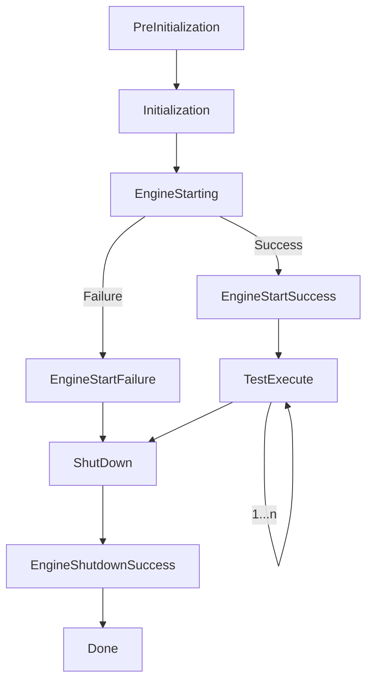
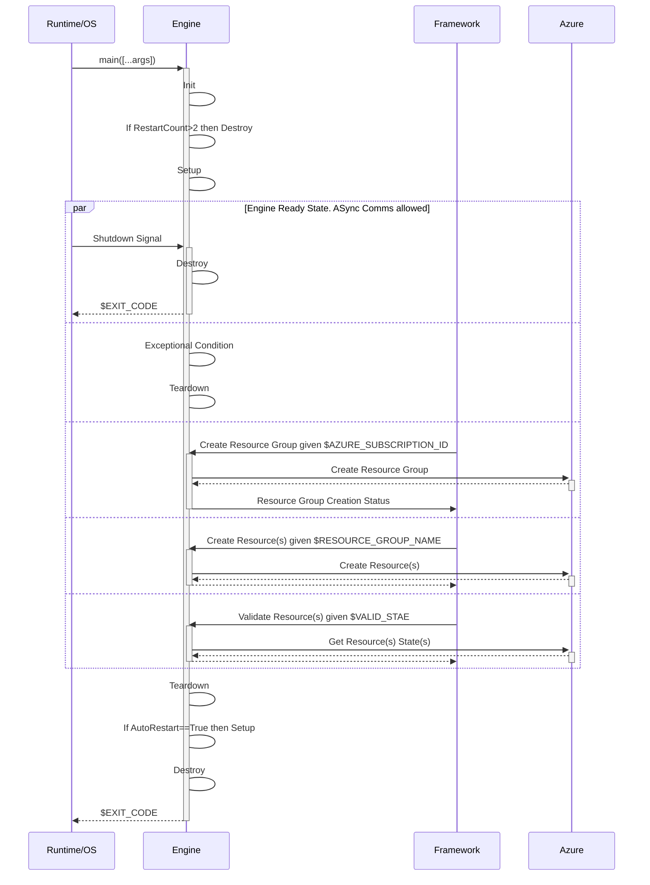

# Benchpress Testing Framework Design

## Overview
The core Benchpress engine proposes an *Inversion of Control* (IoC) design paradigm. In this design, we transfer the control of objects or portions of a program to a container or framework for orchestrating and execution.

Few advantages of IoC design is that it enables test writers to use any language-specific framework of their choice. For example, in C# *NUnit*, *XUnit*, and *MSTest* are some of the most popular choices.

The primary goal of the Benchpress testing framework is to start and stop the *Core testing Engine* in a thread-safe manner, while also supporting injecting optional runtime configuration into the engine.

Some examples of runtime configuration that the framework may provide to the engine include:
  - Number of automatic restarts due to exception conditions the engine should undergo before reporting a fatal error to the framework.
  - Number of automatic retries should the engine make when interacting over the network before reporting a fatal error to the framework.
  - How long of a time period should the engine wait during network interactions before entering a timeout condition and reporting a fatal error to the framework.

Our API allows test authors to include declarative decorators/annotations/attributes on their test methods and/or test classes that will intercept the flow-of-control at runtime to execute the various pre/post lifecycle management steps - including ensuring an engine process instance is available - allowing for massively concurrent test execution.

## State Diagram

Internally the testing framework has a state machine that allows it to track and execute events and test methods.



## Public API

The public API **only** needs to be called in frameworks/languages where IoC is not possible, e.g., Powershell/Pester. In such cases, the expectation is that users will call `Start()` to configure the testing enviornment and on test teardown call `Stop()`.

- `Init()` - Init singleton instance
- `PreEngineStart` - Optional Configuration
- `StartEngine()` - Start the engine
- `StopEngine()` - Stop the engine

## Example Test

### Method-level
```c#
class Test1
{
    // Annotate at method level
    [BenchpressTest]
    public void TestRG()
    {
        var result = Benchpress.DoesResourceGroupExist("my-rg");
        Debug.Assert(result, true);
    }

    // Annotate at method level
    [BenchpressTest]
    public void Test_ResourceGroupExists()
    {
        var result = Benchpress.DoesResourceGroupExist("my-rg");
        Debug.Assert(result, true);
    }
}
```

### Class-level
```c#
// Annotate at class level
[BenchpressTest]
class Test2
{
    public void TestRG()
    {
        var result = Benchpress.DoesResourceGroupExist("my-rg");
        Debug.Assert(result, true);
    }

    public void Test_ResourceGroupExists()
    {
        var result = Benchpress.DoesResourceGroupExist("my-rg");
        Debug.Assert(result, true);
    }
}
```

### Subscribe to life-cycle events
```c#
// Listen to life-cycle events
[BenchpressTest]
class Test3
{
    [Initization]
    public void OnInitization() { /* ... */ }
    
    [EngineStartSuccess]
    public void OnEngineStartSuccess() { /* ... */ }
    
    [EngineStartFailure]
    public void OnEngineStartFailure() { /* ... */ }
    
    [TestExecute]
    public void OnTestExecute(MethodInfo method) { /* ... */ }
    
    [Shutdown]
    public void OnShutdown() { /* ... */ }
    
    [Done]
    public void OnDone() { /* ... */ }

    [Fact]
    public void TestResourceGroupExists()
    {
        var result = Benchpress.DoesStorageAccountExists("mystorage");
        Debug.Assert(result == true, "Test failed");
    }

    [Fact]
    public void TestStorageAccountPolicy()
    {
        var result = Benchpress.DoesStorageAccountExists("mystorage--222");
        Debug.Assert(result == true, "Test failed");
    }
}
```

### Lifecycle Event Descriptions
```
Init() // Called once at the very start of test execution before the engine is started. This method can be used to perform or pre-execution steps. 

PreEngineStart(RetryCount = 3, HttpTimeout = 60000, KeepAlive = true, ...more configuration) – Called once to start the engine if not already started 

StartEngine() // Performs resource locking and starts the engine

OnEngineStartSuccess() // Called once if the engine is started successfully 

OnEngineStartFailure() // Called once the engine is started successfully. 

PreTestExecute(method) // Called once before each test executes. 

OnTestExecute(method) // Called once after the test executes. 

PreTestExecute(method) // Called once before each test executes. 

StopEngine() // Performs resource locking and stops the engine

TearDown() // Called once after the engine is stopped and before Done() is called

Done() // Called at the end once of framework 
```

### Proposed Sequence Diagram
    

