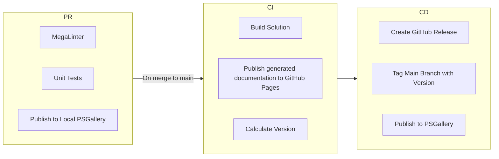

# CI/CD Process and Explanation of Workflows

This document will go over the high level design and architecture of the current CI/CD process.

## Overview

The current CI/CD process generally consists of three stages, and each stage handles certain steps.
The three "stages" are:

- Pull Request (PR)
- Continuous Integration (CI)
- Continuous Deployment (CD)

### Pull Request

When any pull requests are opened with a target branch of `main`, they will automatically trigger the PR stage of the
CI/CD process. This stage consists of the following steps:

- [`pr-mega-linter.yml`](../.github/workflows/pr-mega-linter.yml) - Running [MegaLinter](https://megalinter.io/latest/)
  for code styling and formatting.
- [`pr-dotnet.yml`](../.github/workflows/pr-dotnet.yml) and [`pr-powershell`](../.github/workflows/pr-powershell.yml) -
   Unit tests (for .NET Solution and PowerShell code) for code quality and testing.

### Continuous Integration

After pull requests are merged to the `main` branch, they will automatically trigger the CI stage of the CI/CD process.
This stage consists of the following steps:

- [`ci.yml`](../.github/workflows/ci.yml) - builds the .NET solution and the final module file for BenchPress. It also
tests the module for deployability to a local PS Repo. Lastly, it generates documentation using help comments for
PowerShell cmdlets and saves documentation to a branch named `docs`. A PR will need to be **manually** created with any
changes pushed to the `docs` branch in order to merge them into `main`.
  - The local "PowerShell Gallery" uses the workflow runner's local filesystem to simulate PowerShell Gallery. We then
    push and pull from this filesystem using the same PowerShell cmdlets that are used to interact with PowerShell
    Gallery.
- [`ci-module-versioning.yml`](../.github/workflows/ci-module-versioning.yml) - calculating the version for the
  PowerShell module using GitVersion and writing it to the module manifest on a branch named `version`. A PR will
  need to be **manually** created with any changes pushed to the `version` branch in order to merge them into `main`.
- [`ci-publish-docs-branch.yml`](../.github/workflows/ci-publish-docs-branch.yml) - generates documentation using help
  comments for PowerShell cmdlets, formats the documents, and saves documentation to a branch named `docs`.

### Continuous Deployment

The final stage of the CI/CD process is the CD stage. This stage is a little unlike the others where some of the steps
are not automatically triggered. This stage consists of the following steps:

- [`cd-psgallery.yml`](../.github/workflows/cd-psgallery.yml) - manually triggered to handle deploying the PowerShell
  module to the public PowerShell Gallery.
- [`cd-publish-docs-branch.yml`](../.github/workflows/cd-publish-docs-branch.yml) - publish autogenerated documentation
  to GitHub Pages.
- [`cd-create-version-tag.yml`](../.github/workflows/cd-create-version-tag.yml) - triggered if a PR was merged from
  `version` branch into the `main` branch and will handle tagging the `main` branch.
- [`cd-github-release.yml`](../.github/workflows/cd-github-release.yml) - triggered if `main` is tagged with a version
  and will create a GitHub release with that version.

### Workflows Outside of CI/CD Process

There is one workflow to callout that is a little bit outside of this typical CI/CD process. During the CI stage, there
were two steps described that generated changes and pushed those changes to new branches (`docs` and `version`). We
have created a workflow [`create-automated-prs.yml`](../.github/workflows/create-automated-prs.yml) which will be
triggered when new changes are pushed to those branches and open a PR if so.

- [`cd-version-tag-release.yml`](../.github/workflows/cd-version-tag-release.yml) - triggered if a PR was merged from
  `version` branch into the `main` branch. It will handle tagging the `main` branch and creating a GitHub release with
  that version tag.
